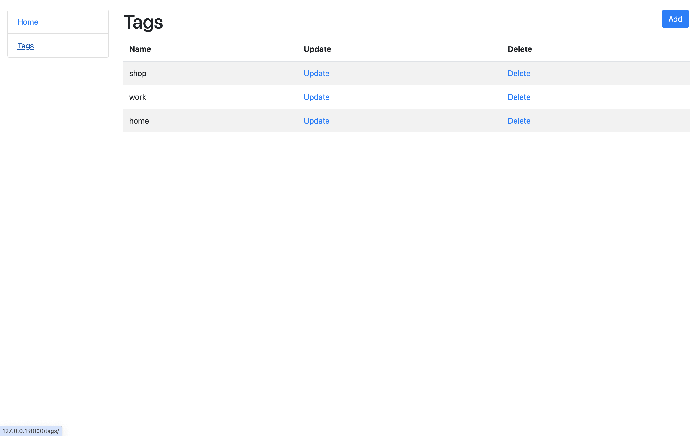

# Todo List Project

A simple, user-friendly platform to manage tasks with tagging functionality.
## Project Description

This Todo List project allows users to create, manage, and organize their tasks efficiently. Users can add tags to tasks, set optional deadlines, mark tasks as complete or incomplete, and browse tasks by their status or creation date. The interface provides an easy-to-use experience for handling daily to-do items.
## Features

* **Task Management**: Create and update tasks with a clear user interface.
* **Tag Management**: Organize tasks by tagging them with relevant labels. Each task can have multiple tags, and tags can belong to multiple tasks.
* **Task Status Toggle**: Mark tasks as complete or incomplete with a simple toggle button.
* **Order Tasks**: Tasks are automatically ordered from incomplete to complete and from newest to oldest.
* **Task Information**: View task details, including content, creation date, optional deadline, and tags.
* **Sidebar Navigation**: Access the home page and tag list page easily via a sidebar available on every page.
* **Tag List Management**: View, update, and delete tags from a dedicated tag list page.
* **User-Friendly Interface**: Intuitive navigation and functionality for managing tasks and tags.





## Technological Stack

* **Backend**: Django
* **Frontend**: HTML, CSS
* **Database**: SQLite
* **Environment Management**: Python Virtual Environment (.venv)
* **Version Control**: Git, GitHub


Use the login and password of the administrator and the test user for the test site:

login:admin-
password:1qazcde3

## Installation Instructions

Follow these steps to set up the project locally:

1. **Clone the repository:**
    ```shell
    git clone https://github.com/Viesich/todo_list.git
    cd todo_list
    ```

2. **Set up a virtual environment:**
    ```shell
    python3 -m venv venv
    source venv/bin/activate  # For Unix or MacOS
    venv\Scripts\activate  # For Windows
    ```

3. **Install the required packages:**
    ```shell
    pip install -r requirements.txt
    ```

4. **Run the server:**
    ```shell
    python manage.py runserver  # Starts the Django server
    ```

```plaintext
Task
- id (Primary Key)
- content
- date_of_create
- deadline
- is_done
- tags

Tag
- id (Primary Key)
- name
